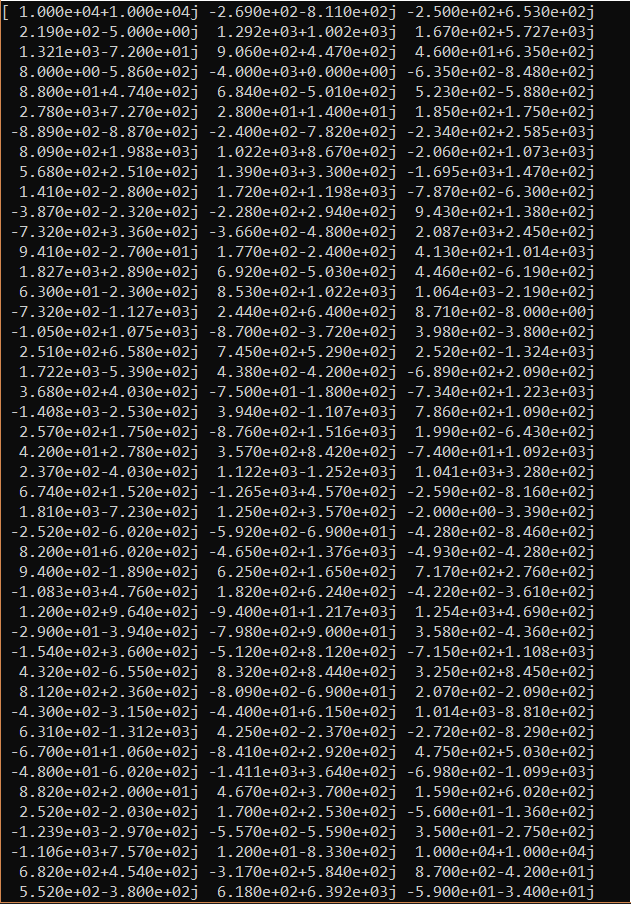
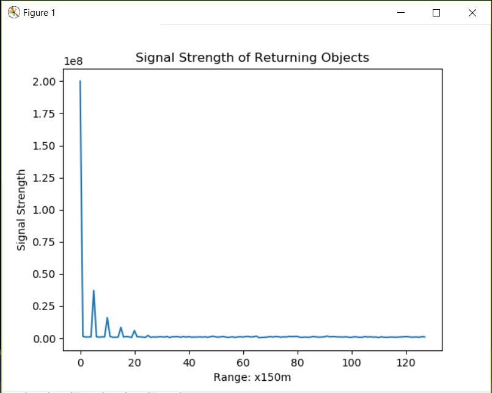
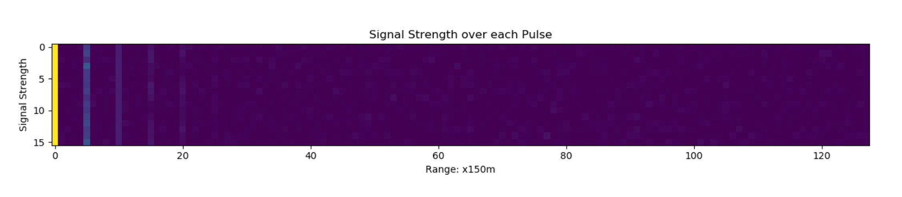
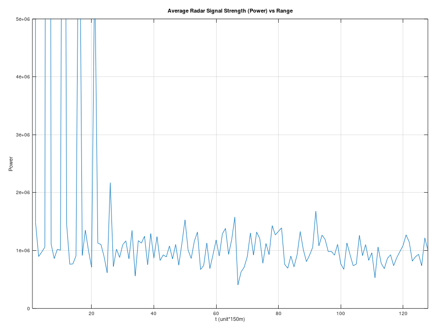
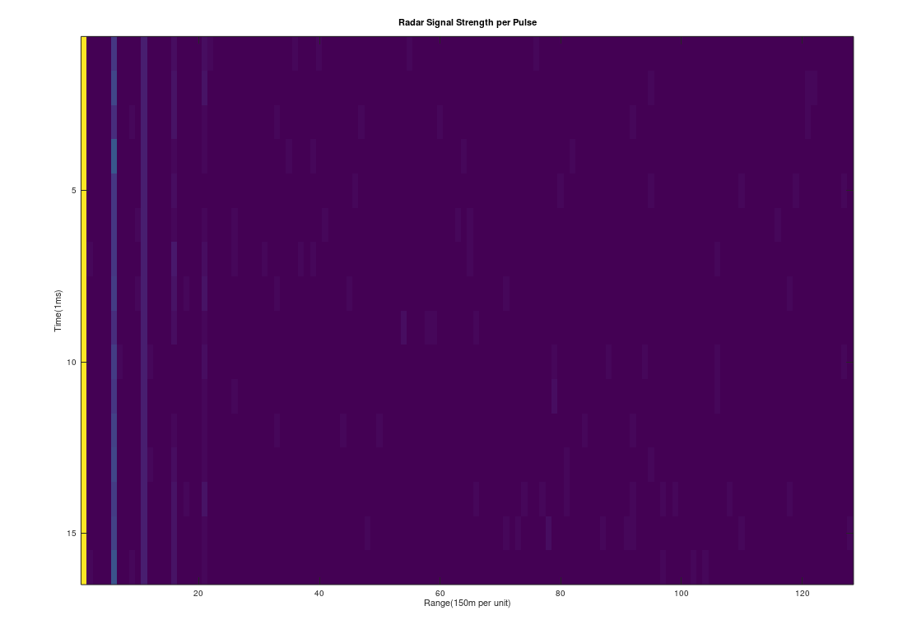

# BasicComplexSignal
Basic Complex Analysis of Sample Radar I/Q Signals

## Intro

This script processes an incoming radar sample in the form of [In-phase and Quadrature Data](https://en.wikipedia.org/wiki/In-phase_and_quadrature_components).

The data is a theoretical return signal from 16 radar antenna pulses, each separated by 1ms from each other. Each return pulse is sampled at a rate of 1M samples/per second with a total of 128 sample data for each pulse for a total 2048 samples. The sample data are in 16-bit integer form and every two samples represent one complex number. Thus, there are 4096 entries in the .dat file located in the assets folder.

Assuming the speed of light is c = 300,000,000 m/s, each returning sample is separated by a distance of 150m (300,000,000 m/sec / (2 * 1,000,000 samples/sec) and the maximum unambiguous range is 150km.

### Data Visualization

## Methods

Since the incoming signals are proportional to the Voltage level, take the square of each signal data should be proportional to power as well. Reflected signals off of airborne objects should result in higher than normal returns over the ambient noise levels.

## Python Results

### Average Return Signal Power from all 16 pulses over 128 samples.  

### Time Graph of Return Signal Power (each pulse is separated by 1 ms)

## Octave Results

### Equivalent graph from Octave

